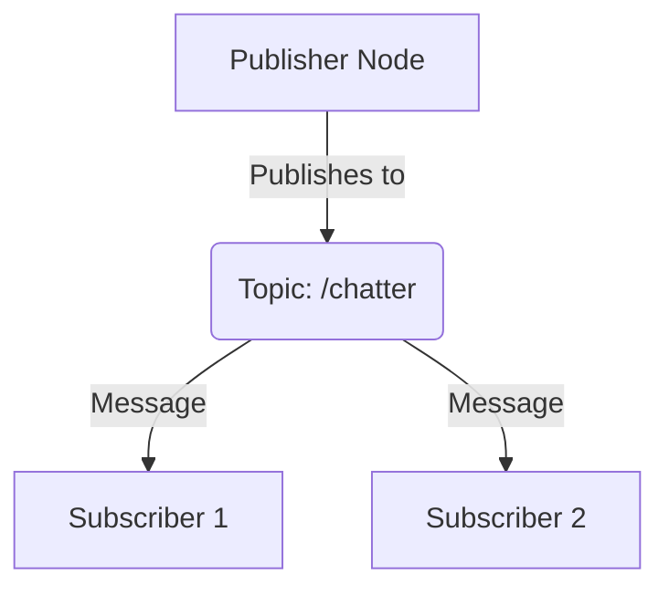

# Lesson 1.2: Understanding Topics & Services 

## Section 1: Theory

In ROS 2, **topics** and **services** are two fundamental communication mechanisms that allow nodes to exchange data.

### Topics (Asynchronous Communication)

**Topics** follow a **publish/subscribe** model. One or more nodes (publishers) can publish messages to a topic, and one or more nodes (subscribers) can subscribe to that topic to receive the messages.

- **Asynchronous:** Publishers don't wait for subscribers to receive the message. They simply send it and move on.
- **One-to-many:** A single publisher can send messages to multiple subscribers.
- **Use Cases:** Ideal for continuous data streams, such as sensor data, camera images, or robot state information.

### Services (Synchronous Communication)

**Services** follow a **request/response** model. A node (the client) sends a request to a service, and another node (the server) processes the request and sends back a response.

- **Synchronous:** The client waits for the server to respond before continuing its execution.
- **One-to-one:** A service request is handled by a single server.
- **Use Cases:** Suitable for remote procedure calls (RPCs), such as triggering an action on a robot (e.g., "move to a specific location") or querying for a piece of information (e.g., "get the robot's current position").

## Section 2: Diagram (Mermaid JS)

This diagram illustrates the publish/subscribe model with a single publisher and two subscribers.



## Section 3: Code Example (Simple Publisher)

Here is a Python example of a simple publisher node that publishes a "Hello World" message with a counter to a topic named `/chatter`.

```python
import rclpy
from rclpy.node import Node
from std_msgs.msg import String

class SimplePublisher(Node):
    def __init__(self):
        super().__init__('simple_publisher')
        self.publisher_ = self.create_publisher(String, 'chatter', 10)
        self.timer = self.create_timer(0.5, self.timer_callback)
        self.i = 0

    def timer_callback(self):
        msg = String()
        msg.data = f'Hello World: {self.i}'
        self.publisher_.publish(msg)
        self.get_logger().info(f'Publishing: "{msg.data}"')
        self.i += 1

def main(args=None):
    rclpy.init(args=args)
    node = SimplePublisher()
    try:
        rclpy.spin(node)
    except KeyboardInterrupt:
        pass
    finally:
        node.destroy_node()
        rclpy.shutdown()

if __name__ == '__main__':
    main()
```

### How to Run this Example:
1.  Save the code in a Python file (e.g., `publisher.py`).
2.  Build your ROS 2 package.
3.  Run the publisher node:
    ```bash
    ros2 run <your_package_name> publisher
    ```
4.  In a separate terminal, you can listen to the `/chatter` topic using the `ros2 topic echo` command:
    ```bash
    ros2 topic echo /chatter
    ```
    You will see the messages from the publisher being printed to the console.